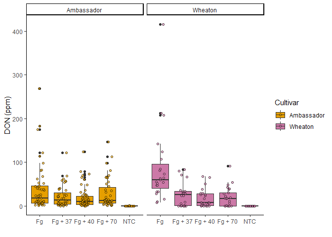
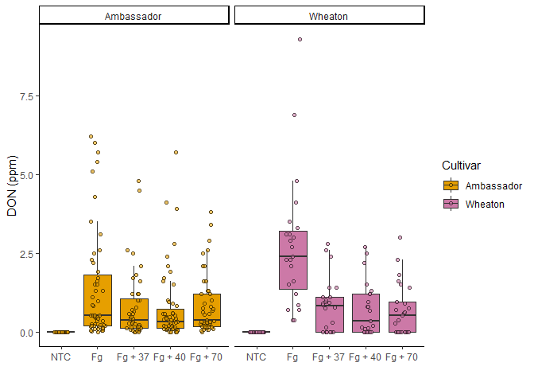
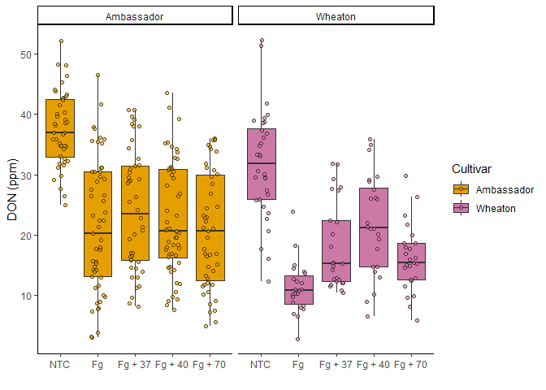
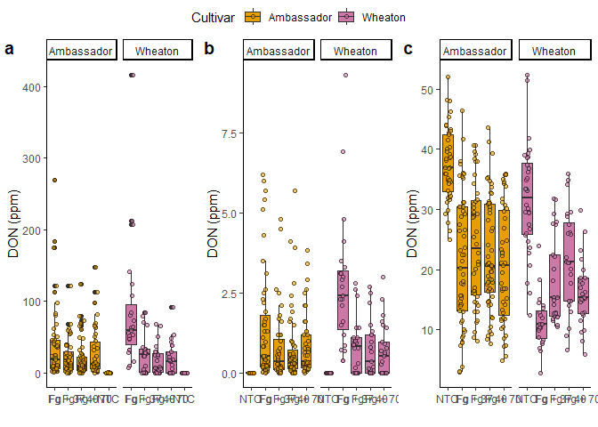
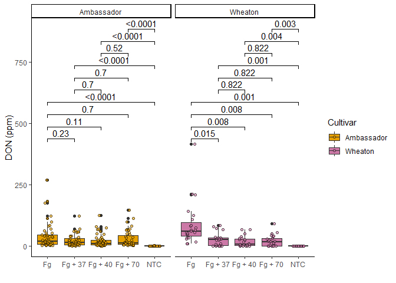
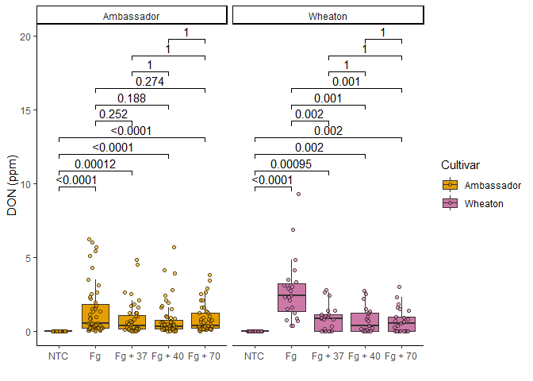
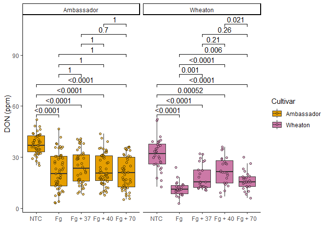
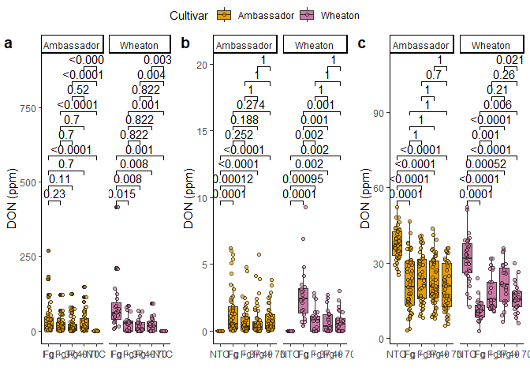

The data is accessible via the link in this citation: Noel, Z.A., Roze,
L.V., Breunig, M., Trail, F. 2022. Endophytic fungi as promising
biocontrol agent to protect wheat from Fusarium graminearum head blight.
Plant Disease. [Link text](https://doi.org/10.1094/PDIS-06-21-1253-RE)

# Question 1

1.  YAML header includes title, author, date, output
2.  Literate programming is a mixture of input code and outputs of code
    that allow for fully reproducible documents.

# Question 2

``` r
cbbPalette <- c("#000000", "#E69F00", "#56B4E9", "#009E73", "#F0E442", "#0072B2", "#D55E00", "#CC79A7")
```

``` r
library(readr)
MycotoxinData <- read.csv("MycotoxinData.csv",na.strings = "na")
View(MycotoxinData)
```

``` r
DON_data <- read.csv("MycotoxinData.csv", na.strings = "na")
str(DON_data)
```

    ## 'data.frame':    375 obs. of  6 variables:
    ##  $ Treatment     : chr  "Fg" "Fg" "Fg" "Fg" ...
    ##  $ Cultivar      : chr  "Wheaton" "Wheaton" "Wheaton" "Wheaton" ...
    ##  $ BioRep        : int  2 2 2 2 2 2 2 2 2 3 ...
    ##  $ MassperSeed_mg: num  10.29 12.8 2.85 6.5 10.18 ...
    ##  $ DON           : num  107.3 32.6 416 211.9 124 ...
    ##  $ X15ADON       : num  3 0.85 3.5 3.1 4.8 3.3 6.9 2.9 2.1 0.71 ...

## CC3 Q1

``` r
library(ggplot2)
DON_plot <- ggplot(MycotoxinData, aes(x = Treatment, y = DON, fill = Cultivar)) +
  geom_boxplot() +
  xlab("") +
  ylab("DON (ppm)") +
  geom_jitter(alpha = 0.6, pch = 21, color = "black", position = position_jitterdodge()) +
  scale_fill_manual(values = c(cbbPalette[[2]], cbbPalette[[8]])) +
  facet_wrap(~Cultivar) + 
  theme_classic()
DON_plot
```

    ## Warning: Removed 8 rows containing non-finite outside the scale range
    ## (`stat_boxplot()`).

    ## Warning: Removed 8 rows containing missing values or values outside the scale range
    ## (`geom_point()`).

<!-- -->

``` r
recordPlot()
```

## CC3 Q2

``` r
MycotoxinData$Treatment <- factor(MycotoxinData$Treatment, levels = c("NTC", "Fg", "Fg + 37", "Fg + 40", "Fg + 70"))
```

## CC3 Q3

``` r
DON15 <- ggplot (MycotoxinData, aes(x = Treatment, y = X15ADON, fill = Cultivar)) +
  geom_boxplot(outliers = F) +
  xlab("") +
  ylab("DON (ppm)") +
  geom_jitter(alpha = 0.6, pch = 21, color = "black", position = position_jitterdodge()) +
  scale_fill_manual(values = c(cbbPalette[[2]], cbbPalette[[8]])) +
  facet_wrap(~Cultivar) + 
  theme_classic()
DON15
```

    ## Warning: Removed 10 rows containing non-finite outside the scale range
    ## (`stat_boxplot()`).

    ## Warning: Removed 10 rows containing missing values or values outside the scale range
    ## (`geom_point()`).

<!-- -->

``` r
recordPlot()
```

``` r
DONSeed <- ggplot (MycotoxinData, aes(x = Treatment, y = MassperSeed_mg, fill = Cultivar)) +
  geom_boxplot(outliers = F) +
  xlab("") +
  ylab("DON (ppm)") +
  geom_jitter(alpha = 0.6, pch = 21, color = "black", position = position_jitterdodge()) +
  scale_fill_manual(values = c(cbbPalette[[2]], cbbPalette[[8]])) +
  facet_wrap(~Cultivar) + 
  theme_classic()
DONSeed
```

    ## Warning: Removed 2 rows containing non-finite outside the scale range
    ## (`stat_boxplot()`).

    ## Warning: Removed 2 rows containing missing values or values outside the scale range
    ## (`geom_point()`).

<!-- -->

``` r
recordPlot()
```

## CC3 Q4

``` r
library(tidyverse)
```

    ## ── Attaching core tidyverse packages ──────────────────────── tidyverse 2.0.0 ──
    ## ✔ dplyr     1.1.4     ✔ stringr   1.5.1
    ## ✔ forcats   1.0.0     ✔ tibble    3.2.1
    ## ✔ lubridate 1.9.4     ✔ tidyr     1.3.1
    ## ✔ purrr     1.0.4     
    ## ── Conflicts ────────────────────────────────────────── tidyverse_conflicts() ──
    ## ✖ dplyr::filter() masks stats::filter()
    ## ✖ dplyr::lag()    masks stats::lag()
    ## ℹ Use the conflicted package (<http://conflicted.r-lib.org/>) to force all conflicts to become errors

``` r
library(ggpubr)
library(ggrepel)
```

``` r
ggarrange(DON_plot, DON15, DONSeed, labels = "auto", ncol = 3, nrow = 1, common.legend = T)
```

    ## Warning: Removed 8 rows containing non-finite outside the scale range
    ## (`stat_boxplot()`).

    ## Warning: Removed 8 rows containing missing values or values outside the scale range
    ## (`geom_point()`).

    ## Warning: Removed 8 rows containing non-finite outside the scale range
    ## (`stat_boxplot()`).

    ## Warning: Removed 8 rows containing missing values or values outside the scale range
    ## (`geom_point()`).

    ## Warning: Removed 10 rows containing non-finite outside the scale range
    ## (`stat_boxplot()`).

    ## Warning: Removed 10 rows containing missing values or values outside the scale range
    ## (`geom_point()`).

    ## Warning: Removed 2 rows containing non-finite outside the scale range
    ## (`stat_boxplot()`).

    ## Warning: Removed 2 rows containing missing values or values outside the scale range
    ## (`geom_point()`).

<!-- -->

## CC3 Q5

``` r
stats_DON_plot <- DON_plot +
  geom_pwc(aes(group = Treatment), method = "t_test", label = "p.adj.format")
stats_DON_plot
```

    ## Warning: Removed 8 rows containing non-finite outside the scale range
    ## (`stat_boxplot()`).

    ## Warning: Removed 8 rows containing non-finite outside the scale range
    ## (`stat_pwc()`).

    ## Warning: Removed 8 rows containing missing values or values outside the scale range
    ## (`geom_point()`).

<!-- -->

``` r
recordPlot()
```

``` r
stats_DON15 <- DON15 +
  geom_pwc(aes(group = Treatment), method = "t_test", label = "p.adj.format")
stats_DON15
```

    ## Warning: Removed 10 rows containing non-finite outside the scale range
    ## (`stat_boxplot()`).

    ## Warning: Removed 10 rows containing non-finite outside the scale range
    ## (`stat_pwc()`).

    ## Warning: Removed 10 rows containing missing values or values outside the scale range
    ## (`geom_point()`).

<!-- -->

``` r
recordPlot()
```

``` r
stats_DONSeed <- DONSeed +
  geom_pwc(aes(group = Treatment), method = "t_test", label = "p.adj.format")
stats_DONSeed
```

    ## Warning: Removed 2 rows containing non-finite outside the scale range
    ## (`stat_boxplot()`).

    ## Warning: Removed 2 rows containing non-finite outside the scale range
    ## (`stat_pwc()`).

    ## Warning: Removed 2 rows containing missing values or values outside the scale range
    ## (`geom_point()`).

<!-- -->

``` r
recordPlot()
```

## Combined

``` r
ggarrange(stats_DON_plot, stats_DON15, stats_DONSeed, labels = "auto", ncol = 3, nrow = 1, common.legend = T)
```

    ## Warning: Removed 8 rows containing non-finite outside the scale range
    ## (`stat_boxplot()`).

    ## Warning: Removed 8 rows containing non-finite outside the scale range
    ## (`stat_pwc()`).

    ## Warning: Removed 8 rows containing missing values or values outside the scale range
    ## (`geom_point()`).

    ## Warning: Removed 8 rows containing non-finite outside the scale range
    ## (`stat_boxplot()`).

    ## Warning: Removed 8 rows containing non-finite outside the scale range
    ## (`stat_pwc()`).

    ## Warning: Removed 8 rows containing missing values or values outside the scale range
    ## (`geom_point()`).

    ## Warning: Removed 10 rows containing non-finite outside the scale range
    ## (`stat_boxplot()`).

    ## Warning: Removed 10 rows containing non-finite outside the scale range
    ## (`stat_pwc()`).

    ## Warning: Removed 10 rows containing missing values or values outside the scale range
    ## (`geom_point()`).

    ## Warning: Removed 2 rows containing non-finite outside the scale range
    ## (`stat_boxplot()`).

    ## Warning: Removed 2 rows containing non-finite outside the scale range
    ## (`stat_pwc()`).

    ## Warning: Removed 2 rows containing missing values or values outside the scale range
    ## (`geom_point()`).

<!-- -->

# Question 3
