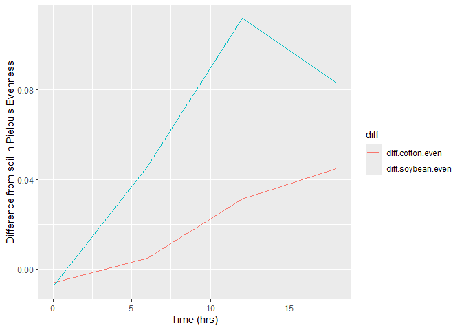

# Question 1 and 2

``` r
library(tidyverse)
```

    ## ── Attaching core tidyverse packages ──────────────────────── tidyverse 2.0.0 ──
    ## ✔ dplyr     1.1.4     ✔ readr     2.1.5
    ## ✔ forcats   1.0.0     ✔ stringr   1.5.1
    ## ✔ ggplot2   3.5.1     ✔ tibble    3.2.1
    ## ✔ lubridate 1.9.4     ✔ tidyr     1.3.1
    ## ✔ purrr     1.0.4     
    ## ── Conflicts ────────────────────────────────────────── tidyverse_conflicts() ──
    ## ✖ dplyr::filter() masks stats::filter()
    ## ✖ dplyr::lag()    masks stats::lag()
    ## ℹ Use the conflicted package (<http://conflicted.r-lib.org/>) to force all conflicts to become errors

``` r
Diversity.Data <- read.csv("DiversityData.csv")
str(Diversity.Data)
```

    ## 'data.frame':    70 obs. of  5 variables:
    ##  $ Code      : chr  "S01_13" "S02_16" "S03_19" "S04_22" ...
    ##  $ shannon   : num  6.62 6.61 6.66 6.66 6.61 ...
    ##  $ invsimpson: num  211 207 213 205 200 ...
    ##  $ simpson   : num  0.995 0.995 0.995 0.995 0.995 ...
    ##  $ richness  : int  3319 3079 3935 3922 3196 3481 3250 3170 3657 3177 ...

``` r
Meta.data <- read.csv("Metadata.csv")
str(Meta.data)
```

    ## 'data.frame':    70 obs. of  5 variables:
    ##  $ Code         : chr  "S01_13" "S02_16" "S03_19" "S04_22" ...
    ##  $ Crop         : chr  "Soil" "Soil" "Soil" "Soil" ...
    ##  $ Time_Point   : int  0 0 0 0 0 0 6 6 6 6 ...
    ##  $ Replicate    : int  1 2 3 4 5 6 1 2 3 4 ...
    ##  $ Water_Imbibed: chr  "na" "na" "na" "na" ...

``` r
alpha <- left_join(Diversity.Data, Meta.data, by = "Code") # adding the meta data to the diversity data based on on the common column of Code
head(alpha)
```

    ##     Code  shannon invsimpson   simpson richness Crop Time_Point Replicate
    ## 1 S01_13 6.624921   210.7279 0.9952545     3319 Soil          0         1
    ## 2 S02_16 6.612413   206.8666 0.9951660     3079 Soil          0         2
    ## 3 S03_19 6.660853   213.0184 0.9953056     3935 Soil          0         3
    ## 4 S04_22 6.660671   204.6908 0.9951146     3922 Soil          0         4
    ## 5 S05_25 6.610965   200.2552 0.9950064     3196 Soil          0         5
    ## 6 S06_28 6.650812   199.3211 0.9949830     3481 Soil          0         6
    ##   Water_Imbibed
    ## 1            na
    ## 2            na
    ## 3            na
    ## 4            na
    ## 5            na
    ## 6            na

# Question 3

``` r
alpha2 <- alpha %>%
  mutate(even = shannon/log(richness))

alpha$even <- alpha$shannon/log(alpha$richness)
```

# Question 4

``` r
alpha_average <- alpha2 %>%
  select(Time_Point, Crop, even) %>% 
  group_by(Crop, Time_Point) %>% 
  summarise(Mean.even = mean(even),
            n = n(), 
            sd.dev = sd(even)) %>%
  mutate(std.err = sd.dev/sqrt(n))
```

    ## `summarise()` has grouped output by 'Crop'. You can override using the
    ## `.groups` argument.

# Question 5

``` r
alpha_average2 <- alpha_average %>%
  select(Time_Point, Crop, Mean.even) %>% 
pivot_wider(names_from = Crop, values_from = Mean.even) %>%
mutate(diff.cotton.even = Soil - Cotton) %>% 
mutate(diff.soybean.even = Soil - Soybean)
```

# Question 6

``` r
alpha_average2_diff <- alpha_average2 %>%
  select(Time_Point, diff.cotton.even, diff.soybean.even) %>%
  pivot_longer(c(diff.cotton.even, diff.soybean.even), names_to ="diff")
library(ggplot2)
ggplot(alpha_average2_diff,aes(x = Time_Point, y = value, color = diff)) +geom_line()+
xlab("Time (hrs)") + ylab("Difference from soil in Pielou's Evenness")
```

<!-- -->

# Question 7
